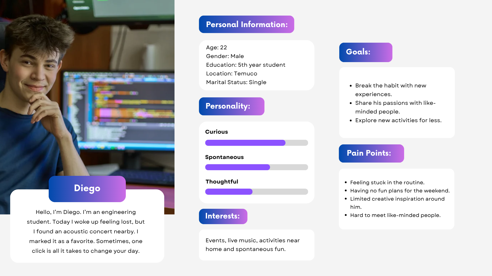
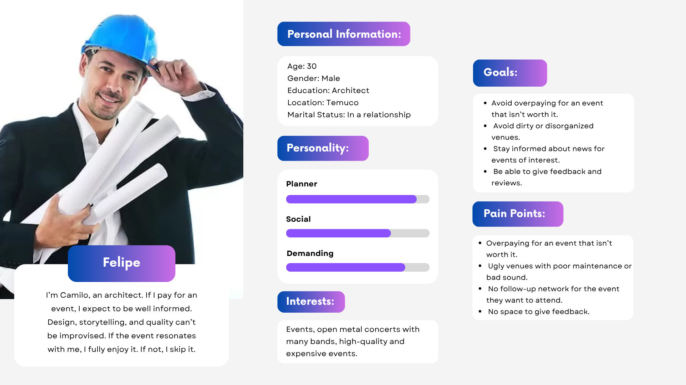
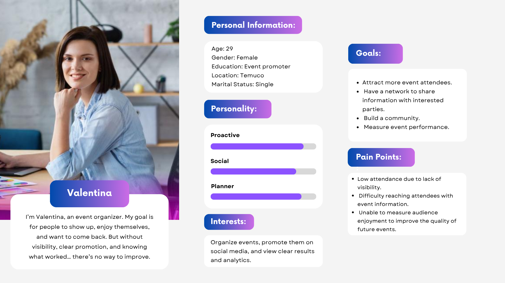
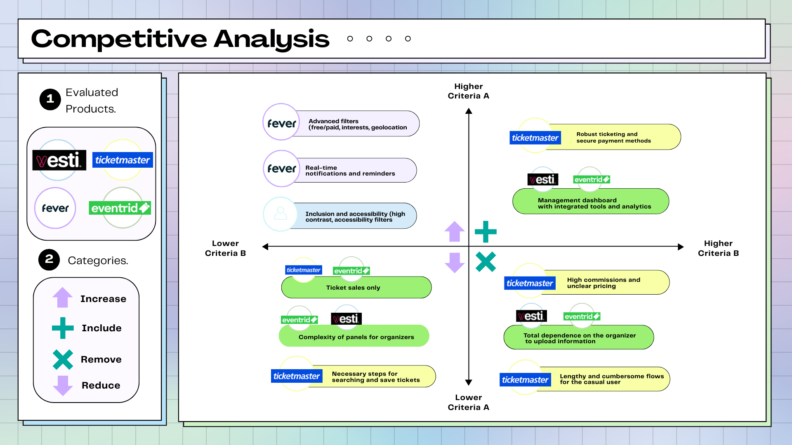

# Eventy

A Local Event Discovery Platform

## Index

1. [Introduction](#1-introduction)
   - [The Problem](#11-the-problem)
   - [Our Solution](#12-our-solution)
2. [Team & Roles](#2-team--roles)
3. [Strategy](#3-strategy)
   - [Value Proposition Canvas](#31-value-proposition-canvas)
   - [UX Personas](#32-ux-personas)
   - [Benchmarking](#33-benchmarking)
4. [Scope](#4-scope)
   - [Customer Journey Map](#41-customer-journey-map)
5. [Structure](#5-structure)
   - [Navigation Flow](#51-navigation-flow)
6. [Skeleton](#6-skeleton)
   - [Low-Fidelity Wireframes](#61-low-fidelity-wireframes)
7. [Surface](#7-surface)
   - [High-Fidelity Interfaces](#71-high-fidelity-interfaces)

---

## 1. Introduction

### 1.1 The Problem

People interested in cultural, recreational, or academic activities often miss events that match their interests because information is scattered across multiple sources, social media, outdated websites, or informal channels.  
Meanwhile, local organizers struggle to promote their activities effectively due to limited marketing resources and the lack of accessible digital tools.

**Pain points include**:

- Overpaying for events that don't meet expectations
- Poor promotion and visibility of local events
- Lack of real-time updates or notifications
- Limited social interaction with attendees

### 1.2 Our Solution

Eventy was created to bridge that gap, connecting people with the experiences around them while giving visibility to local organizers.  
The app brings together event information into one simple, location-based, and personalized platform that helps users easily discover, share, and attend activities that matter to them.

Key features:

- Interactive map showing nearby events
- Personalized feed of events
- Integrated calendar and reminders
- Social sharing and attendee interaction
- Organizer tools for event creation and promotion
- Ticketing and registration for free or paid events
- Accessibility features (high contrast, adjustable text, mobility-friendly filters)

---

## 2. Team & Roles

- **Felipe Márquez** – Project Manager
- **Diego Marillán** – Analyst & Presenter
- **Francisco Cárdenas** – Designer

---

## 3. Strategy

### 3.1 Value Proposition Canvas

**Customer Segments**

- **Attendees:** Discover events, stay informed, attend activities aligned with interests
- **Organizers:** Publish events, attract attendees, collect feedback

**Gains & Pains**

- **Attendees:** Want clear, centralized information; struggle with scattered sources and missing events
- **Organizers:** Struggle with engagement, marketing, and feedback analysis

**Value Proposition**

- **Pain Relievers:** Centralized information, intuitive interface, reminders, reviews & ratings, promotion tools
- **Gain Creators:** Personalized recommendations, social interaction, calendar integration, higher visibility for local events
- **Products & Services:** Organizer panel, event search, calendar integration, notifications, map and routing integration

### 3.2 UX Personas

- **Diego:** Student, limited budget, seeks free/low-cost local activities  
  
- **Felipe:** Working professional seeking high-quality cultural/social experiences  
  
- **Valentina:** Organizer, aims for better visibility and engagement of her events  
  

### 3.3 Benchmarking

**Platforms analyzed:** Vesti, Ticketmaster, Fever, Eventrid

**Insights:**

- Gaps in local, geo-based event discovery
- Limited social or calendar features in existing platforms
- Opportunity for Eventy: regionally inclusive, personalized, and community-focused

---

## 4. Scope

### 4.1 Customer Journey Map

Key stages:

1. **Awareness:** Discover Eventy via social media/search
2. **Consideration:** Explore events via map/list, apply filters
3. **Decision:** Mark attendance, buy tickets, add to calendar
4. **Loyalty & Advocacy:** Share events, follow organizers, leave feedback

---

## 5. Structure

### 5.1 Navigation Flow

The navigation flow illustrates how users move through the core sections of Eventy, ensuring intuitive access to key functionalities such as event discovery, creation, and profile management.
It provides a clear overview of the main user journeys and how different screens are connected to support a seamless experience.

Eventy’s main sections:

---

## 6. Skeleton

### 6.1 Low-Fidelity Wireframes

The low-fidelity wireframes represent the initial visual structure of Eventy, focusing on layout, information hierarchy, and core user flows.  
They are used to validate usability and navigation before moving on to high-fidelity design stages, allowing quick iteration and feedback from early testing.

Key screens include:

- Home / Event Feed
- Map View & List View
- Event Detail Pages
- Organizer Panel
- Calendar & Notifications

These early prototypes help ensure intuitive navigation and clear information flow before advancing to the final design phase.

The complete set of low-fidelity wireframes can be found in the following links:

- 📄 [PDF version](./docs/Wireframes.pdf)
- 🎨 [View on Figma](https://www.figma.com/design/3WD7RXPMW6taBvm9YXsUaM/Wireframes?node-id=0-1&p=f&t=VNTLRqJD4CHRhR73-0)

---

## 7. Surface

### 7.1 High-Fidelity Interfaces

The high-fidelity interfaces represent the final visual stage of Eventy’s design process, showcasing the complete look and feel of the platform.  
These screens incorporate visual consistency, accessibility improvements, and interactive components based on the validated low-fidelity prototypes.  
Their goal is to provide a realistic preview of the final user experience before implementation.

Key screens include:

- Home / Event Discovery: featured events, search, filters
- Event Detail: detailed information, map integration, reviews, and ticketing
- User / Organizer Profile: attended or created events, user reviews, personal data management
- Support & Help: assistance and communication with the Eventy team

The complete set of high-fidelity interfaces can be accessed through the following links:

- 📄 [PDF version](./docs/Mock%20ups.pdf)
- 🎨 [View on Figma](https://www.figma.com/design/hBHZViB4UoFl7QPvhv5x88/Mock-up?t=BEeUelzFHUvAH7xT-1)
