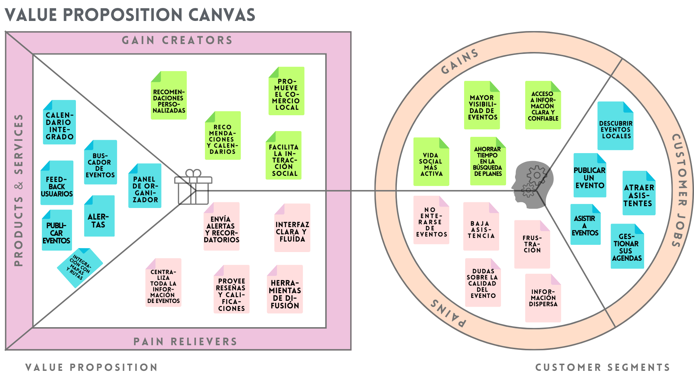

# Canvas de Propuesta de Valor – Eventy

## Imagen del Canvas

---

## Segmento de Cliente: Organizadores de eventos

### Jobs
- Atraer asistentes
- Publicar eventos
- Difundir eventos

### Pains
- Baja asistencia
- Dificultad para difundir eventos

### Gains
- Mayor visibilidad
- Publicar fácilmente
- Promover sus eventos

---

## Propuesta de Valor: Eventy

### Productos y Servicios
- Panel organizador
- Panel de analíticas del evento

### Pain Relievers
- Envío de alertas y recordatorios
- Interfaz clara y fluida
- Sistema para revisar feedback de usuarios.

### Gain Creators
- Difusión colaborativa
- Herramientas para generar comunidad

---

## Otros Segmentos de Cliente

Además de los organizadores, Eventy considera otros perfiles clave:

- **Público casual (universitarios)**: buscan experiencias accesibles, espontáneas y sociales.
- **Turistas**: interesados en eventos locales, culturales o experienciales.
- **Interesados o público específico**: personas con gustos definidos que buscan eventos afines y estar notificados de cualquier actualización del mismo.
